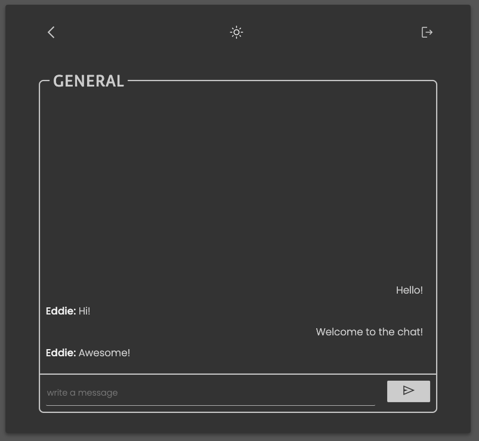

# Chat - MERN

Aplicación de **Chat** realizada con Node.js, React, Mongo DB, Express y Socket.io. El usuario puede registrarse y loguearse para entrar a una sala de chat y chatear en tiempo real. También puede crear múltiples salas y borrarlas.  

## Índice
1. [Capturas](#capturas)
2. [Instrucciones](#instrucciones)
3. [Endpoints](#endpoints)
4. [Documentación](#documentación)  

## Capturas:
### Página de Login:
  
 

### Página de Registro:
    
   

### Página para Crear Sala:
    
 
   

### Página del Chat:
   
   

## Instrucciones:
1. Para ejecutar la aplicación es necesario tener instalado [React](https://es.reactjs.org/) y [Node.js](https://nodejs.org/es/).
2. Renombrar el archivo *congif.env* a *.env* y editar el valor **DATABASE_URL**.
3. Después de clonar el [repositorio de GitHub](https://github.com/eliashz/Chat-MERN), realizar `npm i` desde */client* y desde */server* para la instalación de las dependencias.
4. Teclear `npm start` desde */client* y desde */server* para la ejecución de la aplicación.  
 

## Endpoints:
Para la prueba de los **endpoints**, importar en [Postman](https://www.postman.com/) el archivo *Chat.postman_collection.json*  que está en la carpeta *postman*.  
+ **POST /user/register** - Añade un usuario a la base de datos. 
+ **POST /user/login** - Realiza el login de un usuario mediante el e-mail y la contraseña.
+ **POST /chat** - Añade una sala de chat a la base de datos. 
+ **GET /chat** - Obtiene todas las salas de chat creadas. 
+ **DEL /chat** - Borra una sala de chat por la ID. 
+ **GET /chat/:id** - Busca una sala de chat por la ID.  
 

## Documentación:
+ [Socket.IO](https://socket.io/docs/v4/)
+ [Uso de Fetch **MDN**](https://developer.mozilla.org/es/docs/Web/API/Fetch_API/Using_Fetch)  
+ [Códigos de estado de respuesta HTTP](https://developer.mozilla.org/es/docs/Web/HTTP/Status)   